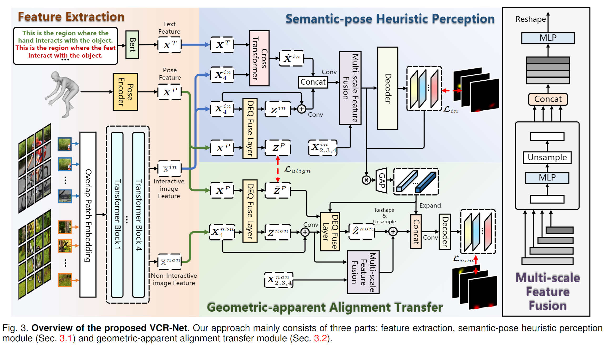

# VCR-Net
PyTorch implementation of our VCR-Net models. 

1. [Paper Link](#1)
2. [Abstract](#2)
3. [Method](#3)
4. [Requirements](#4)
5. [Download CAL dataset](#5)
6. [Test](#6)
7. [Citation](#7)

## 📎 Paper Link <a name="1"></a> 
* Visual-geometric Collaborative Guidance for Affordance Learning  [[pdf]()] 
> Authors:
> Hongchen Luo, Wei Zhai, Jiao Wang, Yang Cao, Zheng-Jun Zha


## 💡 Abstract <a name="2"></a> 
Perceiving potential "action possibilities" (i.e., affordance) regions of images and learning interactive functionalities of objects from human demonstration is a challenging task due to the diversity of human-object interactions. Prevailing affordance learning algorithms often adopt the label assignment paradigm and presume that there is a unique relationship between functional region and affordance label, yielding poor performance when adapting to unseen environments with large appearance variations. In this paper, we propose to leverage interactive affinity for affordance learning, i.e., extracting interactive affinity from human-object interaction and transferring it to non-interactive objects. Interactive affinity, which represents the contacts between different parts of the human body and local regions of the target object, can provide inherent cues of interconnectivity between humans and objects, thereby reducing the ambiguity of the perceived action possibilities. To this end, we propose a visual-geometric collaborative guided affordance learning network that incorporates visual and geometric cues to excavate interactive affinity from human-object interactions jointly. Particularly, a semantic-pose heuristic perception (SHP) module is devised to exploit both semantic and geometric cues to guide the network to focus on interaction-relevant regions, alleviating the effects of combinatorial relational ambiguity. Meanwhile, A geometric-apparent alignment transfer module is introduced to jointly align local regions of apparent and structural similarity, eliminating the transport difficulties posed by intra-class correspondence ambiguity. Besides, a contact-driven affordance learning (CAL) dataset is constructed by collecting and labeling over 55,047 images. Experimental results demonstrate that our method outperforms the representative models regarding objective metrics and visual quality. 

<p align="center">
     <br />
    <em> 
    </em>
</p>
**Interactive affinity.** (a) Interaction affinity refers to the contact between different parts of the human body and the local regions of a target object. (b) The interactive affinity provides rich cues to guide the model to acquire invariant features of the object's local regions interacting with the body part, thus counteracting the multiple possibilities caused by diverse interactions.

## 📖 Method <a name="3"></a> 

<p align="center">
     <br />
    <em> 
    </em>
</p>

**Overview of the proposed cross-view knowledge transfer affordance grounding framework.** It mainly consists of an Affordance Invariance Mining (AIM) module and an Affordance Co-relation Preservation (ACP) strategy. The AIM module (see in Sec. 3.1) aims to obtain invariant affordance representations from diverse exocentric interactions. The ACP strategy (see in Sec. 3.2) enhances the network’s affordance perception by aligning the co-relation of the outputs of the two views.


## Requirements <a name="4"></a>
Environment installation as follows [Segformer](https://github.com/NVlabs/SegFormer)
- python 3.9
```bash 
pip install torch==1.9.0+cu111 torchvision==0.10.0+cu111 torchaudio==0.9.0 -f https://download.pytorch.org/whl/torch_stable.html
pip install mmcv-full -f https://download.openmmlab.com/mmcv/dist/cu111/torch1.9.0/index.html
pip install scipy
pip install einops
pip install torchcontrib
pip install ipython
pip install attr
pip install termcolor
pip install transformers
pip install scikit-image
pip install scikit-learn
```

### Download CAL dataset <a name="5"></a> 
- You can download the CAL dataset from [ [Google Drive]() | [Baidu Pan]()  ].
Download the dataset and place it in the dataset/ folder

### Test <a name="6"></a> 
You can test the trained model by running `test.py`.

```bash  
 python test.py  
```
## Citation <a name="7"></a> 

```
@article{visualluo,
  title={Visual-geometric Collaborative Guidance for Affordance Learning},
  author={Luo, Hongchen and Zhai, Wei and Wang, Jiao and Cao, Yang and Zha, Zheng-Jun},
  journal={arXiv},
  year={2024}
}
```

